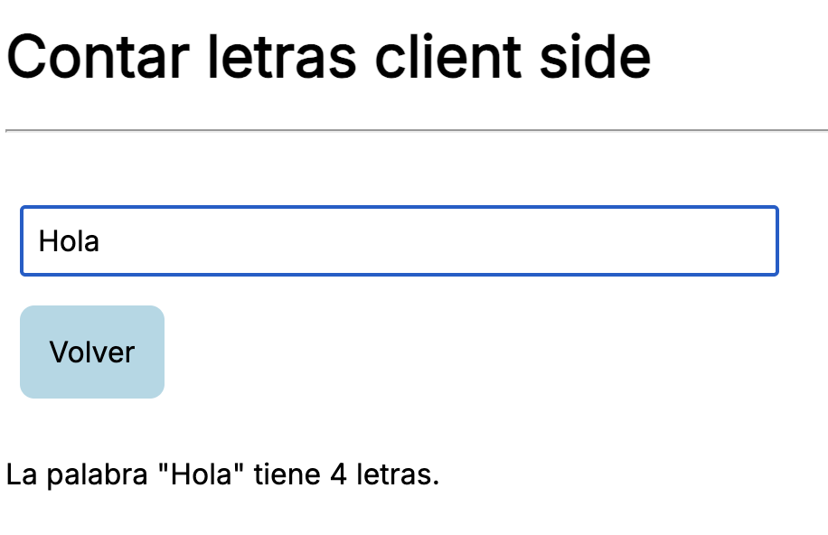
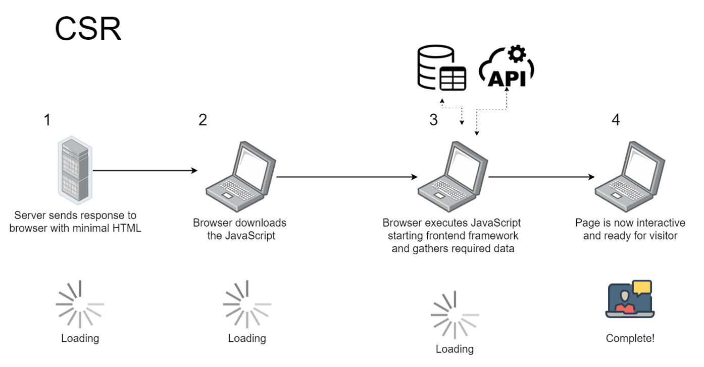
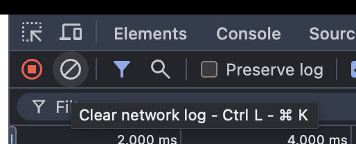
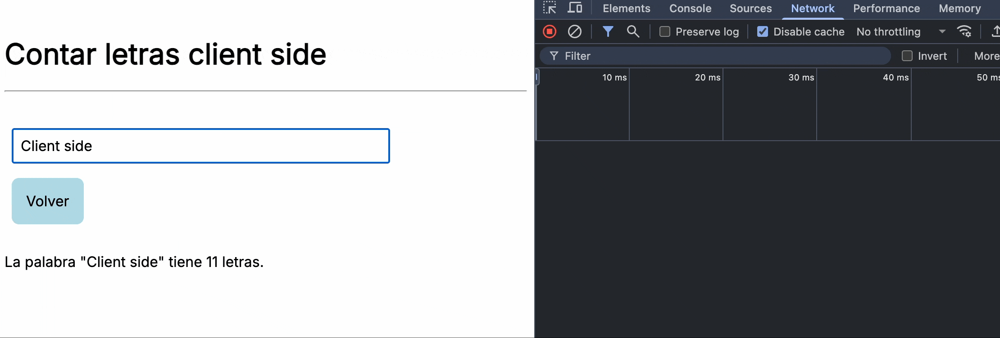
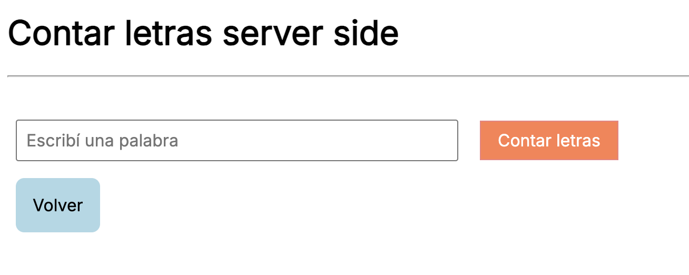
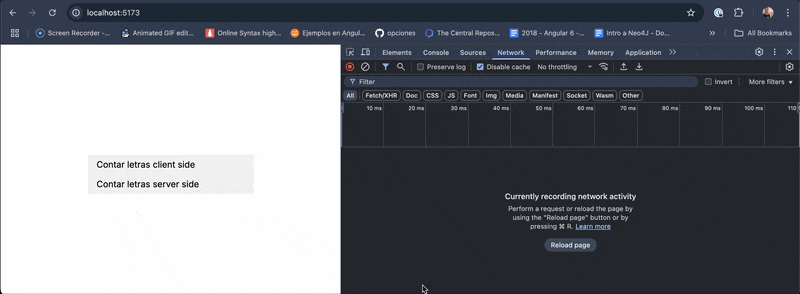
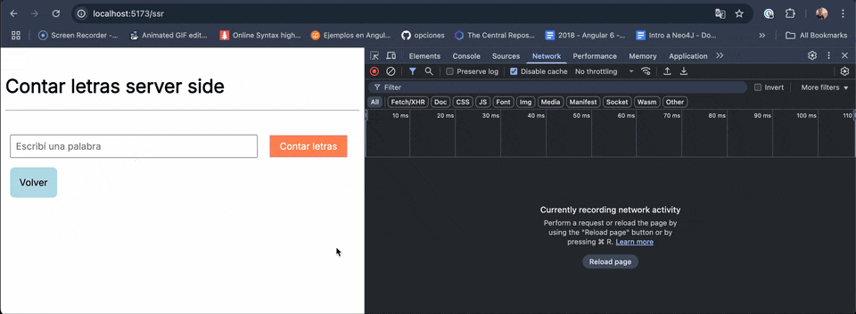

## Ejercicio routing

[](https://github.com/uqbar-project/eg-routing-svelte/actions/workflows/build.yml) [](https://codecov.io/gh/uqbar-project/eg-routing-svelte)

## El ejemplo

Queremos tener

- un input para ingresar un texto
- opcionalmente podemos tener un botón...
- ...y deberíamos visualizar la longitud del texto que ingresamos

## El menú principal

En el menú principal podemos ir a dos páginas diferentes:

- la url `http://localhost:5173/csr`, donde vemos el ejemplo Client Side Rendering
- la url `http://localhost:5173/ssr`, donde vemos el ejemplo Server Side Rendering

Acá comenzamos a ver cómo funciona el mecanismo de routing de Svelte, que está basado en el de un file system:

```
+ src
  + routes
    - +page.svelte <== acá está el menú principal
    + csr
      - +page.svelte <== está la página apuntada por la url `/csr`
    + ssr
      - +page.svelte <== está la página apuntada por la url `/ssr`
```

Entonces por defecto en `src/routes` están las páginas, vos [podés cambiar la configuración `routes` de tu proyecto](https://svelte.dev/docs/kit/routing#:~:text=by%20editing%20the-,project%20config,-.).

## Client-side rendering (CSR)



La resolución es bastante simple, nos alcanza con modelar un `$state` que esté bindeado al input y luego utilizarlo para calcular la longitud:

```svelte
<script lang="ts">
let palabra = $state('')
</script>
...
<div class="row">
  <input name="palabra" data-testid="palabra" bind:value={palabra} placeholder="Escribí una palabra" required />
</div>
...
{#if palabra}
  <div class="row">
    <p data-testid="resultado">La palabra "{palabra}" tiene {palabra.length} letras.</p>
  </div>
{/if}
```

Cuando hablamos de "client-side" tenemos en cuenta la interacción entre nuestro navegador local y el servidor web que está hosteando nuestra aplicación.



Entonces la primera vez que cargamos la página

- nuestro "server" (el localhost:5173 que sirve la app web Svelte) nos envía html
- pero también código javascript
- especialmente el que forma parte del framework de Svelte

Si presionás F12, en la solapa Network vas a poder ver una gran cantidad de descargas de archivos de distinto tipo. Pero ojo, esto ocurre solo la primera vez que comienza la aplicación, o bien si forzás la recarga (con Ctrl + Shift + R).


Si borrás la interacción 



y después escribís en el input, vas a ver que no se dispara ningún pedido hacia el server. El trabajo es absolutamente local, en nuestro cliente.



Más adelante vamos a ver ejemplos donde quizás necesitemos disparar una búsqueda de información al server, aun así seguimos manteniendo la naturaleza client-side: solo vamos al server para buscar datos pero el control de los elementos del DOM se hace siempre en nuestro navegador. Esto implica navegar a otras páginas, mostrar más información o hacer aparecer nuevos elementos visuales, entre otras cosas.

## Server-side rendering (SSR)

En la carpeta SSR podrás ver que tenemos esta estructura de archivos:

```
+ src
  + routes
    + ssr
      - +page.svelte
      - +page.server.ts
      ...
```

### Página svelte

La página Svelte contiene código que vamos a ejecutar en el cliente (el navegador), pero en este caso necesitamos que el procesamiento de la palabra (para obtener la cantidad de letras) lo haga el servidor. La interacción cliente-servidor en web siempre debe comenzar en el servidor, entonces lo más simple en este caso es agregar un botón de Submit que envía la petición al server:



Y para enviar información al server haremos un pedido POST desde un formulario html:

```html
  <form method="POST" use:enhance>
    <input name="palabra" placeholder="Escribí una palabra" data-testid="palabra" required />
    <button type="submit" data-testid="submit">Contar letras</button>
  </form>
```

Algunas cuestiones:

- el input tiene un `name="palabra"`, en el Submit lo que hacemos es armar pares clave-valor en base a estos names
- el form indica el tipo de método http que vamos a usar, en este caso POST
- `use:enhance` propio de Svelte intercepta el formulario y hace internamente una llamada al server mediante `fetch`, una función nativa del entorno de los navegadores. Como consecuencia de ese cambio, no vamos a notar la llamada al servidor (lo que produce un típico parpadeo cuando se recarga toda la página)

### Recibiendo la información

Por convención, el archivo `+page.server.ts` se procesa en el servidor:

- recibimos la información de nuestro formulario HTML, básicamente claves/valor donde el valor será siempre un string al viajar por http
- devolvemos un JSON: la información tiene que ser serializable para poder viajar nuevamente del servidor al cliente por http

```ts
export const actions: Actions = {
  default: async ({ request }) => {
    const formData = await request.formData()
    const palabra = formData.get('palabra')?.toString() || ''
    const longitud = palabra.length
    return { palabra, longitud }
  }
}
```

Lo que hace no es gran cosa pero sirve como ejemplo: obtiene la palabra del formulario y devuelve un JSON con la misma palabra y la longitud correspondiente.



Esa respuesta es recibida por la página Svelte, en el cliente (navegador) para descomponer la información y mostrar un div con el resultado:

```ts
<script lang="ts">
  ...
  export let form: { palabra?: string; longitud?: number } | null
</script>
...
{#if form?.palabra}
  <div class="row">
    <p data-testid="resultado">La palabra "{form.palabra}" tiene {form.longitud} letras.</p>
  </div>
{/if}
```

Cada vez que presionamos el botón estamos yendo al servidor a procesar la palabra:



## Esquema mixto

Si renombramos nuestro archivo `+page.server.ts` a `+page.ts`, Svelte automáticamente va a trabajar en modo mixto

- la primera vez irá al server a procesar la palabra
- también descargará localmente el código (se transpilará de ts a js)
- las sucesivas veces que presionemos el botón Submit se procesará en el cliente


## Testing

### CSR

El testeo de front es similar a ejemplos anteriores, solo es interesante contar la manera en que probamos que el botón Volver nos lleva al punto raíz de la navegación:

```ts
  it('should navigate to the home page when link is clicked', async () => {
    render(Counter)
    const backLink = screen.getByTestId('back-link') as HTMLAnchorElement
    await userEvent.click(backLink)
    expect(window.location.pathname).toBe('/')
  })
```

- buscamos nuestro anchor (a href) por testid
- y chequeamos que al hacer click sobre el elemento eso cambia variable global `window`

### SSR

Como la estrategia SSR es un poco más compleja necesitamos agregar más tests para cubrir todos los casos. Por ejemplo queremos testear que cuando el server nos devuelve una palabra y su longitud, lo sabemos mostrar en el div:

```ts
  it('should show the word length when a word is passed as props', async () => {
    render(Counter, {
      props: {
        form: {
          palabra: 'hola',
          longitud: 4
        }
      }
    })
    const palabra = await screen.getByTestId('palabra') as HTMLInputElement
    expect(palabra.value).to.equal('')
    expect(screen.getByTestId('resultado').textContent).to.equal('La palabra "hola" tiene 4 letras.')
  })
```

Pero también tenemos que chequear la información que pasamos al server cuando escribimos una palabra. Esto hace perder bastante la inocencia de los tests (algo que muchas personas podrían marcar como polémica):

```ts
  it('sends the word by doing a submit', async () => {
    const mockFetch = vi.fn().mockResolvedValue({
      ok: true,
      json: async () => ({
        type: 'success',
        data: { palabra: 'hola', longitud: 4 }
      })
    })

    globalThis.fetch = mockFetch

    render(Counter, { props: { form: null } })

    const input = screen.getByTestId('palabra')
    const submit = screen.getByTestId('submit')

    await userEvent.type(input, 'hola')
    await userEvent.click(submit)

    // Verificar que se llamó fetch
    expect(mockFetch).toHaveBeenCalled()

    // Verificamos el FormData enviado
    const fetchCall = mockFetch.mock.calls[0]
    const requestInit = fetchCall[1] as RequestInit
    expect(requestInit.body).toBeInstanceOf(URLSearchParams)
    const params = new URLSearchParams(requestInit.body as string)
    expect(params.get('palabra')).toBe('hola')
  })
```

Por qué el test pierde su naturaleza naif de caja negra? Porque sabemos que internamente no se dispara un submit hacia el server sino un fetch, mockeamos en consecuencia esta función y esperamos que dentro del segundo parámetro en la primera llamada haya una clave 'palabra'.

Por último, también debemos testear por separado el comportamiento del server:

```ts
  it('should process a word and return its length', async () => {
    const mockRequest = {
      formData: async () =>
        new Map([['palabra', 'svelte']]) as unknown as FormData
    }

    // Simulamos el objeto RequestEvent mínimamente
    const event = { request: mockRequest } as unknown as RequestEvent<RouteParams, '/ssr'>

    const result = await actions.default(event)
    expect(result).toEqual({
      palabra: 'svelte',
      longitud: 6
    })
  })
```

Fíjense que no estamos testeando la interacción cliente/servidor: podríamos cambiar en el archivo `+page.server.ts` el nombre del parámetro a `word`:

```ts
export const actions: Actions = {
  default: async ({ request }) => {
    const formData = await request.formData()
    const palabra = formData.get('word')?.toString() || '' // introducimos un error
    const longitud = palabra.length
    return { palabra, longitud }
  }
}
```

cambiar nuestro test unitario y 1. los tests pasarían correctamente, 2. tendríamos una buena cobertura. Sin embargo la aplicación no funcionaría.
